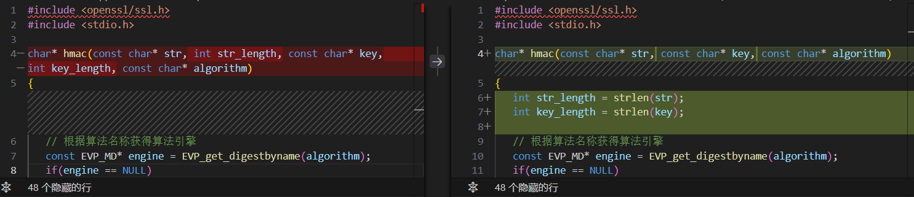
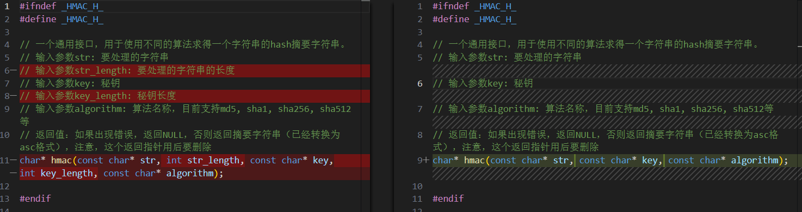
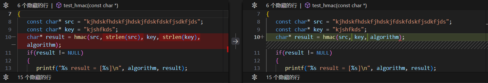
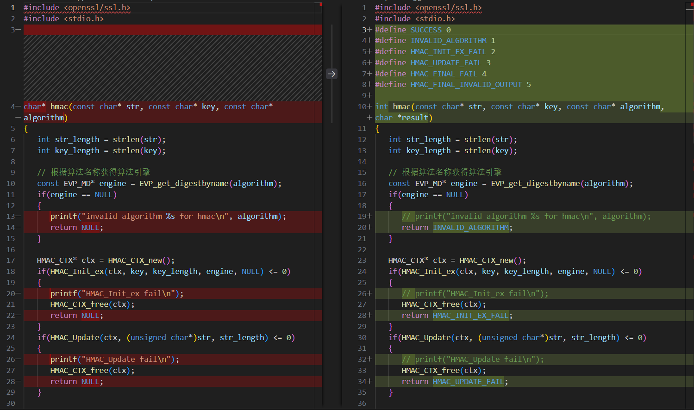
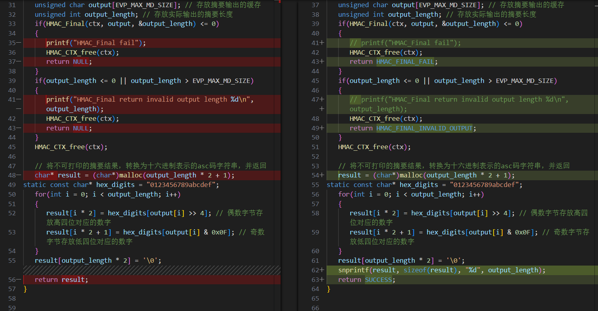
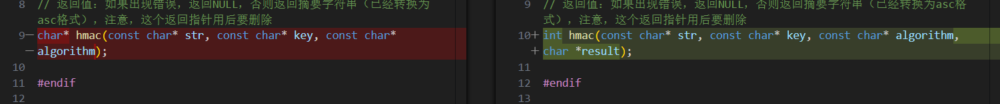
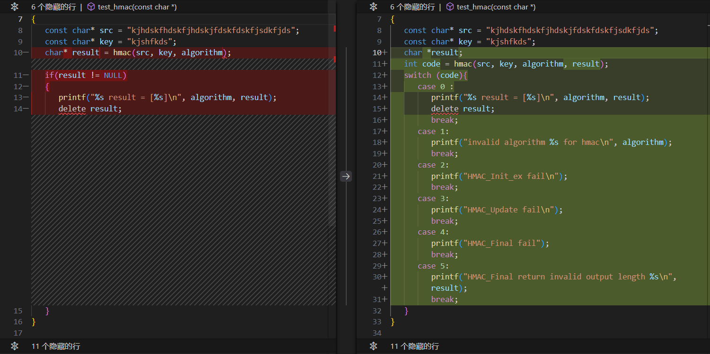
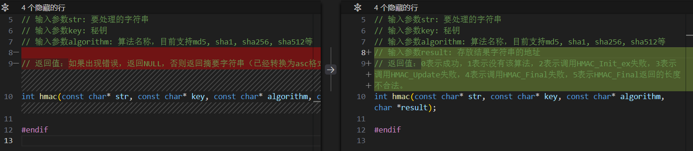
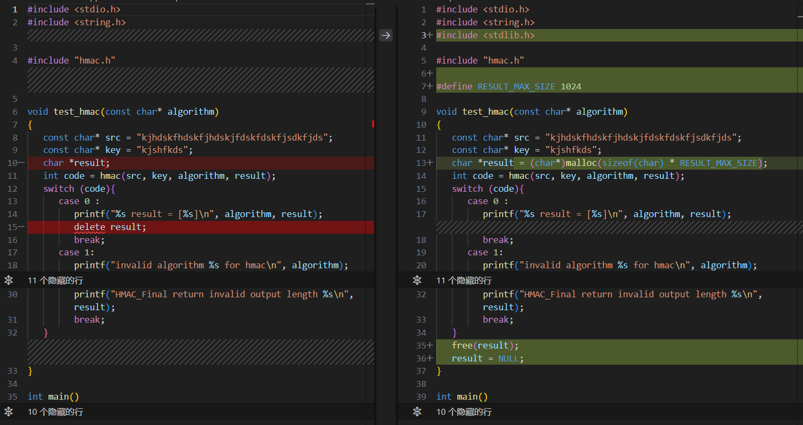

# 北京邮电大学计算机学院程序设计实践接口作业

## 如果觉得有帮助，还请给个 Star ⭐ 支持一下！ 谢谢！

## 问题1

### 问题描述

- 库函数的接口暴露给调用者的概念较多。

### 改进说明

- 删除了 `str_length`、`key_length`等参数。

### 修改记录

#### `hmac.c`

#### `hmac.h`

#### `test.c`


## 问题2

### 问题描述

- 库函数的接口在实现中越俎代疱自己控制程序行为，自己输出错误信息。

### 改进说明

- 将函数的返回类型改为 `int` 型，通过该返回值判断是否正常返回和错误类型，将原本返回的 `result` 改为函数的参数（作为地址传入），将 `hmac.c` 中的 `printf` 语句移到 `test.c` 中执行。

### 修改记录

#### `hmac.c`


#### `hmac.h`

#### `test.c`


## 问题3

### 问题描述

- 库函数自己申请 `result` 地址资源，没有负责释放。没有让调用者自己管理资源。

### 改进说明

- 将 `result` 地址资源的申请和释放都交由 `test.c` 文件来处理。

### 修改记录

#### `hmac.c`

#### `hmac.h`

#### `test.c`


## 实验环境

- 操作系统：`windows11`
- 实验工具；`make` `git bash` `g++`


## 额外修改 `makefile`

- 将 `makefile` 文件中的代码改为适配与 `windows` 操作系统环境的代码
```makefile
libhmac.dll: hmac.c hmac.h
	g++ -shared -o libhmac.dll hmac.c -lssl -lcrypto -I e:/msys64/ucrt64/include -L e:/msys64/ucrt64/lib

test: test.c libhmac.dll
	g++ -Wall -Wextra test.c -o test -L. -lhmac
	./test

clean:
	rm -f test libhmac.dll
```